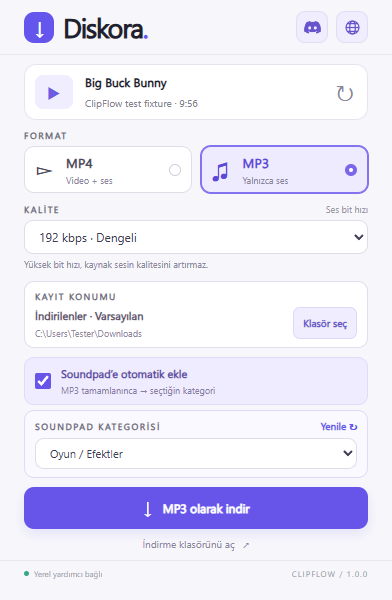

# ClipFlow

Download YouTube videos as MP3 or MP4 on Windows, choose the quality and save folder, and optionally add MP3 files to a Soundpad category.

[Download for Windows](https://github.com/AvsarEmir/ClipFlow/releases/download/v1.0.0/ClipFlow-Windows-1.0.0.zip) · [Releases](https://github.com/AvsarEmir/ClipFlow/releases) · [Diskora](https://www.diskora.com) · [Discord](https://discord.gg/bn5jRSApN7)



## Features

- MP3 at 128, 192, 256, or 320 kbps.
- MP4 in the resolutions available for the source video.
- Windows Downloads or a folder of your choice.
- Optional Soundpad category and subcategory selection.
- Download progress, cancellation, and background downloading while the browser stays open.

The interface is currently in Turkish. The app is named ClipFlow; its header uses the Diskora. brand.

## Requirements

Windows 10/11 64-bit and an internet connection. Soundpad integration requires the full Windows version of Soundpad.

| Browser | Package |
| --- | --- |
| Chrome, Edge, Brave, Opera / GX, Vivaldi, Chromium (engine 120+) | `extension` |
| Firefox 140+ | `extension-firefox` |

Chrome, Edge, and Firefox have been tested in real browsers. The other Chromium variants use the same package but have not been tested individually. Safari, mobile browsers, macOS, and Linux are not supported.

## Installation

1. Download **ClipFlow-Windows-1.0.0.zip** and extract the entire archive.
2. Run **KUR.cmd**. The installer sets up the local helper and downloads yt-dlp, Deno, and FFmpeg. Administrator privileges are not required.
3. Load the extension in your browser:
   - **Chrome / Edge / other Chromium browsers:** open the extensions page, enable **Developer mode**, select **Load unpacked**, and choose `%LOCALAPPDATA%\Akis\extension`.
   - **Firefox:** open `about:debugging#/runtime/this-firefox`, select **Load Temporary Add-on**, and choose `%LOCALAPPDATA%\Akis\extension-firefox\manifest.json`.
4. Pin ClipFlow, open a YouTube video, and select a format and quality.

Firefox's temporary add-on is removed when Firefox closes. The Firefox package is unsigned; permanent installation requires Mozilla signing. Standalone Chromium and Firefox ZIPs also require the local helper from the Windows package.

The `Akis` installation folder is retained for compatibility with earlier builds. The shared helper only needs to be installed once per Windows account.

## Soundpad

Open Soundpad, select **MP3**, enable **Soundpad'e otomatik ekle**, and choose a category. The selection is remembered for that browser profile. Refresh the category list after changing categories in Soundpad.

Automatic import is off by default. Unchecked downloads and MP4 files are not imported. Files are never played automatically. If import fails, the downloaded MP3 stays on disk. Keep imported files in their saved location so Soundpad can find them.

## Updates and removal

- **Update the extension:** finish downloads, disable ClipFlow, run the new package's `KUR.cmd`, then enable and reload the extension.
- **Update download tools:** run `GUNCELLE.cmd` and reload the extension.
- **Helper not found:** run `KUR.cmd` again and select **Yeniden bağlan** in the popup.
- **Uninstall:** run `KALDIR.cmd`, then remove ClipFlow from your browsers. Downloaded media is kept.

Public YouTube videos are supported. Private, members-only, age-restricted, DRM-protected content and ongoing live streams are not supported. YouTube changes may require download-tool updates.

## Development

The repository includes the browser extensions, Windows helper, build scripts, and tests. From the source checkout on Windows:

```powershell
node tests/test_urls.mjs
python tests/test_native.py --work .\test-work
python tests/test_soundpad_consent.py --work .\test-work
powershell -NoProfile -ExecutionPolicy Bypass -File tests/test_install.ps1
powershell -NoProfile -ExecutionPolicy Bypass -File scripts/Build-Packages.ps1
python tests/test_packages.py
```

Tests use simulated downloads and a separate Soundpad test connection. Browser tests use real browsers with mocked native messaging. Node.js and Python are only needed for development.

Builds produce a Windows installation ZIP and standalone Chromium / Firefox ZIPs in `packages`. Test files and build-only scripts are not included in the installation ZIP. Source code is available through GitHub's standard source downloads.

## License

[MIT](LICENSE). yt-dlp, Deno, FFmpeg, and Soundpad retain their own licenses.
